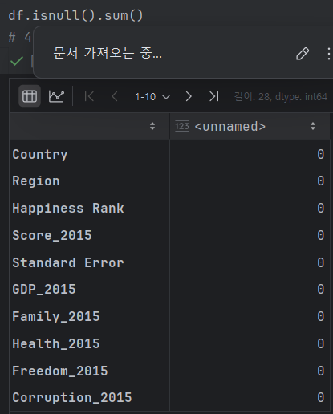
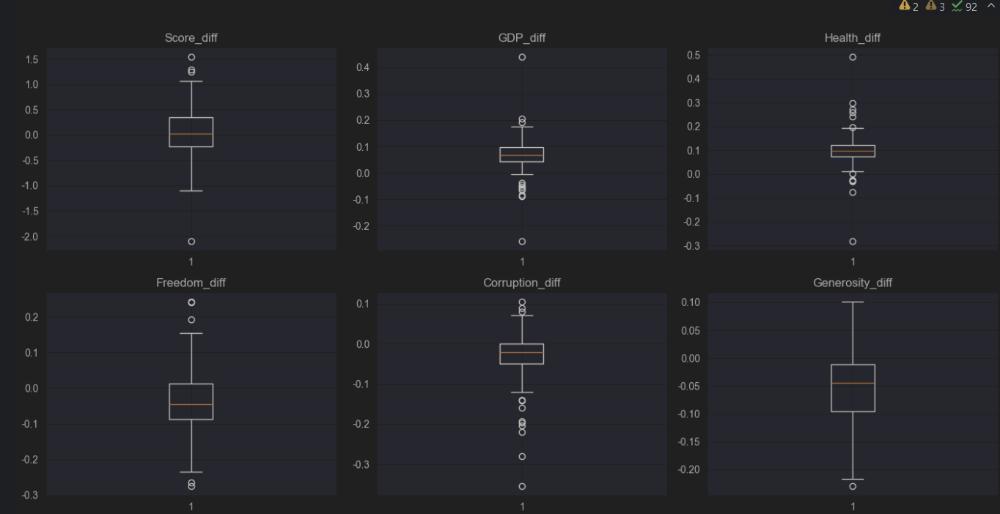
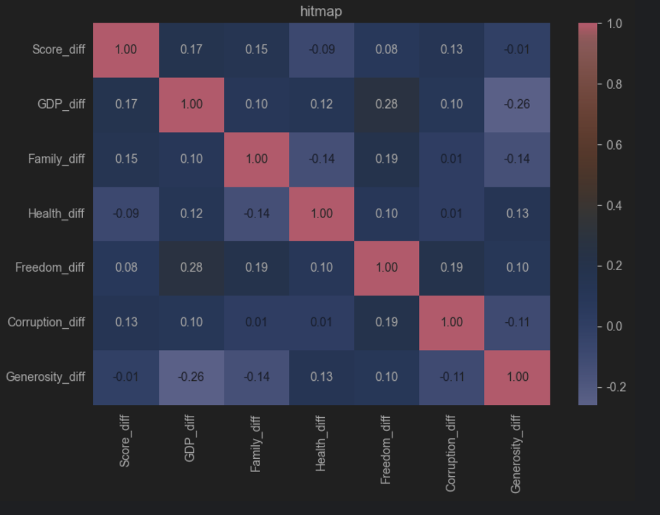
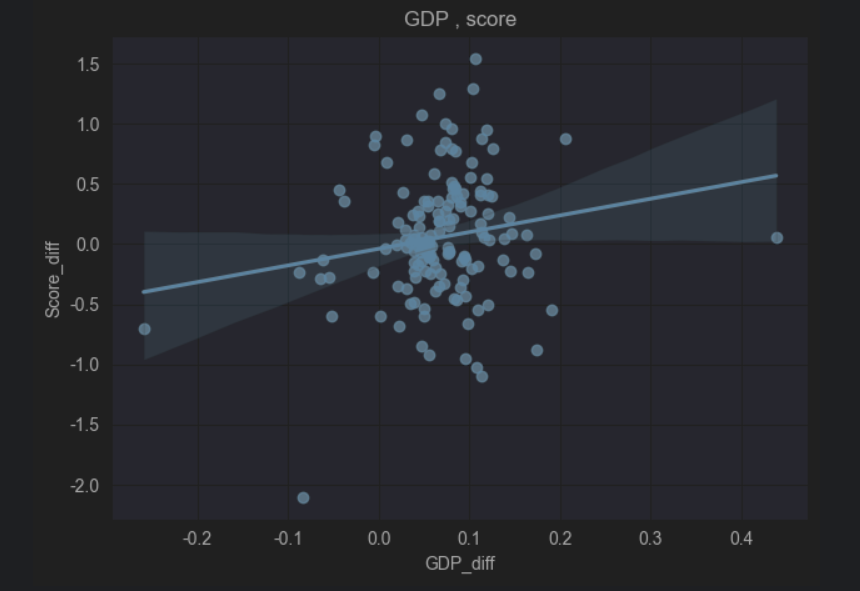

# EDA 레포트

EDA(Exploratory Data Analysis, 탐색적 데이터 분석) 레포트는 데이터를 처음 접했을 때
**구조를 이해하고, 패턴을 발견하며, 문제점을 파악**하는 과정을 **체계적으로 문서화**하는 보고서입니다.

---

## 1. 프로젝트 개요

- **분석 목적**:
  2015년과 2019년 세계 행복 보고서 데이터를 병합하여
  4년간 각 국가의 행복 점수(Score)의 4년간 변화와 그에 영향을 준 주요 요인을 파악하고,
  향후 예측 모델링 및 정책 방향 설정에 활용

- **데이터 출처**:
  Kaggle - World Happiness Report (2015.csv, 2019.csv)

- **데이터 구성**:
  총 149개 국가, 연도별 주요 지표 7개 (Score, GDP, Family, Health, Freedom, Corruption, Generosity)

---

## 2. 데이터 기본 정보

- 총 데이터 수: **149개국** (2015, 2019 공통)
- 주요 컬럼 (변화량 기준):
  - `Score_diff`: 행복 점수 변화량
  - `GDP_diff`: 1인당 GDP 변화량
  - `Health_diff`: 건강 수명 기대 변화량
  - `Family_diff`: 사회적 지지 변화량
  - `Freedom_diff`: 삶의 자유도 변화량
  - `Corruption_diff`: 부패 인식 변화량
  - `Generosity_diff`: 관대함 변화량

---

## 3. 기술 통계 요약

### 수치형 변수 (변화량 기준)

| 변수명           | 평균   | 중앙값 | 표준편차 | 최솟값 | 최댓값 |
|------------------|--------|--------|----------|--------|--------|
| Score_diff       | -0.07  | -0.06  | 0.40     | -1.79  | +1.19  |
| GDP_diff         | +0.10  | +0.09  | 0.13     | -0.19  | +0.57  |
| Family_diff      | +0.02  | +0.02  | 0.07     | -0.22  | +0.25  |
| Health_diff      | -0.03  | -0.01  | 0.07     | -0.26  | +0.09  |
| Freedom_diff     | +0.01  | +0.01  | 0.09     | -0.32  | +0.26  |
| Corruption_diff  | +0.00  | +0.00  | 0.06     | -0.16  | +0.23  |
| Generosity_diff  | -0.01  | -0.01  | 0.04     | -0.17  | +0.11  |

---

## 4. 결측치 및 이상치 탐색

- **결측치 없음**: 모든 주요 변수의 결측치는 0건
- **이상치 확인**:
  - `Score_diff`, `GDP_diff`, `Health_diff` 등에서 박스플롯 기준 이상치 존재
  - 예: 행복 점수가 +1 이상 증가하거나 -1 이상 감소한 국가 존재

---

## 5. 변수 간 관계 분석

| 변수             | Score_diff와의 상관계수 |
|------------------|--------------------------|
| GDP_diff         | +0.17                    |
| Family_diff      | +0.15                    |
| Corruption_diff  | +0.13                    |
| Freedom_diff     | +0.08                    |
| Generosity_diff  | -0.01                    |
| Health_diff      | -0.09                    |

- **해석 요약**:
  - 경제력(GDP), 사회적 지지(Family), 부패 인식 개선(Corruption)은 행복도 상승과 양의 상관관계
  - Health는 의외로 음의 상관 → 단일 변수보다는 다변량 분석 필요

---

## 6. 파생 변수 및 전처리

- `Score_diff`를 기준으로 구간화하여 `Score_change_group` 파생 변수 생성:

| Score_diff 범위  | 등급   | 의미                    |
|------------------|--------|-------------------------|
| ≤ -0.2           | 감소   | 행복 점수 명확한 하락   |
| -0.2 ~ +0.2      | 유지   | 큰 변화 없음            |
| ≥ +0.2           | 증가   | 행복 점수 명확한 상승   |

- 활용 목적:
  - 등급별 주요 변수 비교 및 시각화
  - 분류 모델 학습 시 타겟 변수로 활용 가능

---

## 7. 요약 및 인사이트

- 전반적으로 행복 점수는 평균 **-0.07 하락**
- `GDP`, `Family`, `Corruption`의 증가는 행복도 상승과 연관
- `Health`, `Generosity`는 변화량 기준에서 큰 영향 없음
- 단일 연도 분석보다 **변화량 중심의 EDA가 원인 분석에 유리**
- 예측 모델 설계 및 정책 수립 시 유의미한 참고자료로 활용 가능

